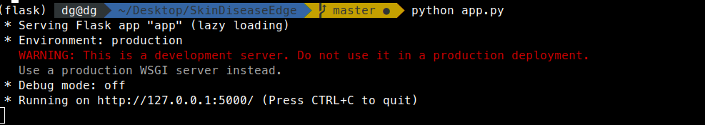

# Skin Disease Detection using AI at the Edge

Skin Disease Detection at edge predicts the disease of skin from the image of that infected part in less than one second and that's where come ai at the edge.

## Getting Started


### Prerequisites

First make sure that you have installed the anaconda.<br />
See this [page](https://docs.anaconda.com/anaconda/install/) for installing anaconda. 

Install the OpenVINO toolkit developed by Intel. OpenVINO toolkit is the secret behind AI at the Edge.<br />
See this [page](https://docs.openvinotoolkit.org/latest/index.html) for installing anaconda.

### Installing

Create a new environment using anaconda:-

```
conda create -n <envname> python=3.7
```

For more information see [here](https://docs.conda.io/projects/conda/en/latest/user-guide/tasks/manage-environments.html)

Activate the environment:-

```
conda activate <envname>
```

Install all the requirements:-

```
pip install -r requirements.txt
```

## Running the app

Activate the created environment:-

```
conda activate <envname>
```

Activate the openvino source:- 

&lt;put your own openvino installation directory in the below command&gt;
  
```
source </opt/intel/openvino/bin>/setupvars.sh
```

Open the terminal/cmd in project directory or use

```

cd <project_directory>
```

# Open the edge_app.py file and change the CPU_EXTENSION as per your installation directoty of openvino.

Now finally run the app.py file using python:-

```
python app.py
```

Open the link as specified in terminal which would be like as shown in the picture:- 



So open the link shown as terminal here which is:- http://127.0.0.1:5000/

Home page will be like this:-


Click on the identify button of the page.

It will redirect you to upload page:-


Upload the skin disease image:-


Now click on the upload button.

It will give the result as shown in below picture:-


